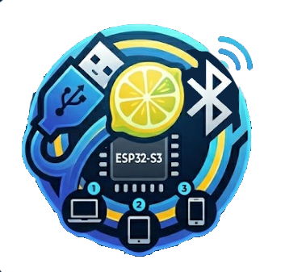

[English](README.md) | [🌏 中文](README.cn.md)

---

# USB HID → BLE Bridge

**Version: V2.0.1**

> **V2.0.1** — Improved connection stability: automatic recovery from USB transfer interruptions and unresponsive device watchdog with self-restart.
>
> **V2.0.0** — Closed-source fork from [ESP32S3-USB-Keyboard-To-BLE](https://github.com/loommii/ESP32S3-USB-Keyboard-To-BLE), upgraded to a combo keyboard+mouse HID bridge.
>
> — Adds USB mouse support (motion accumulator engine, HID Report Descriptor parser, Boot/Report protocol auto-switching), LED states expanded to 10, task scheduling optimizations.

Turns wired USB keyboards and mice into a wireless Bluetooth (BLE) combo HID device using an ESP32-S3, with support for up to 3 paired hosts.

## First-Time Setup

1. Plug in the USB keyboard and/or mouse → power on → **red LED** (USB initializing)
2. LED changes to **blinking purple** (keyboard only) / **blinking blue** (mouse only) / **blinking yellow** (keyboard + mouse) → board starts BLE advertising
3. Search for **"Loommii-HID-01"** on your computer or phone and pair
4. A **6-digit pairing code** appears on the host screen
5. **Type the pairing code on your USB keyboard** and press **Enter**
6. LED turns **solid green** (keyboard only) / **solid blue** (mouse only) / **solid yellow** (keyboard + mouse) → pairing successful, ready to use
7. To switch devices: press `Scroll Lock + 2` (or `Scroll Lock + 3`) to switch to the second/third device, search for **"Loommii-HID-02"** (or **"-03"**) on that device and repeat steps 3–6

> Press **Esc** at any time during pairing code entry to cancel pairing.

## Compatibility

> Tested by the author. Devices and systems not listed may still be compatible.

| Keyboard | Host | Result |
|----------|------|--------|
| Logitech K845 | Windows PC (Intel AX201 Bluetooth) | ✓ |
| Logitech K845 | Android Tablet | ✓ |
| Logitech K845 | Mac Mini M4 | ✓ |

## Hardware Requirements

| Item | Spec |
|------|------|
| MCU | ESP32-S3 series (author uses ESP32-S3-N16R8, approx. ¥20 online) |

## Flashing

### Method 1: Web flashing page (Recommended)

1. Download firmware from [GitHub Releases](https://github.com/loommii/ESP32S3-HID-To-BLE-Releases/releases)
2. Click "Connect and flash"
3. Select the serial port → wait for completion → device reboots automatically

## Features

- **Combo HID bridge** — supports both USB keyboard and mouse simultaneously, presented as a single composite HID device over BLE
- **Mouse motion accumulator** — ring buffer + timer-based resampling + residual compensation for smooth, lag-free cursor movement
- **NONE interface skip** — automatically filters out macro keys, RGB control, and other NONE-protocol HID interfaces, conserving USB host channel resources
- **Boot/Report protocol auto-switch** — automatically selects between Boot and Report protocols, compatible with both standard and gaming peripherals
- **3-host switching** — pair with up to 3 hosts, switch instantly via hotkey
- **Independent MAC addresses** — each slot uses its own MAC, hosts see them as distinct physical devices
- **Persistent bonding** — auto-reconnects on switch, no re-pairing needed
- **CapsLock / NumLock / ScrollLock LED sync** — turn off NumLock on the host, the keyboard LED goes out simultaneously
- **Keyboard pairing code entry** — type the pairing code directly on your USB keyboard, no screen or extra buttons needed
- **Hotkey switching & unpairing** — Scroll Lock modifier combos, no extra buttons

## LED Status

| State | Color | Description |
|-------|-------|-------------|
| USB disconnected | Solid red | No USB device plugged in or not ready |
| Keyboard only, waiting for BLE | Blinking purple | USB keyboard ready, BLE advertising |
| Mouse only, waiting for BLE | Blinking blue | USB mouse ready, BLE advertising |
| Keyboard + mouse, waiting for BLE | Blinking yellow | Both USB devices ready, BLE advertising |
| Keyboard + BLE connected | Solid green | Normal operation |
| Mouse + BLE connected | Solid blue | Mouse-only mode |
| Keyboard + mouse + BLE connected | Solid yellow | Full connection mode |
| Pairing code entry | Solid purple | Waiting for user to type the pairing code |
| Switching | Solid yellow | Device slot switching in progress (reboot pending) |
| Error | Solid red | USB communication error |

## Hotkeys

**Scroll Lock** is used as the modifier (press Scroll Lock first, then the action key):

| Hotkey | Action |
|--------|--------|
| `Scroll Lock + 1` | Switch to Slot 1 |
| `Scroll Lock + 2` | Switch to Slot 2 |
| `Scroll Lock + 3` | Switch to Slot 3 |
| `Scroll Lock + Esc` | Unpair current device (clear bonding) |

## Device Names

| Slot | BLE Name |
|------|----------|
| 1 | Loommii-HID-01 |
| 2 | Loommii-HID-02 |
| 3 | Loommii-HID-03 |

## Specifications

| Item | Details |
|------|---------|
| SDK | ESP-IDF v6.0.1 |
| BLE Stack | Apache NimBLE |
| BLE Appearance | Generic (composite device, required for macOS recognition) |
| BLE HID Reports | Keyboard ID=1, Consumer Control ID=2, Mouse ID=3 |
| USB HID Protocol | Boot Protocol + Report Protocol (auto-switch) |
| Mouse Sampling | 128-event ring buffer, ~133 Hz timer-based resampling |
| Bluetooth Version | BLE 5.0 (compatible with BLE 4.x and later) |
| Power | Powered via ESP32-S3 USB port (no external supply needed) |
| Indicator | On-board WS2812 RGB LED, 10 states indicating device status |
