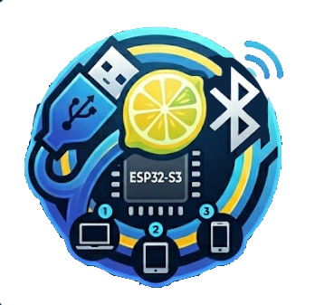

[English](README.md) | [🌏 中文](README.cn.md)

---

# USB HID → BLE Bridge

**Version: V3.0.0**

> **V3.0.0** — Desktop client architecture rewrite (three-layer separation); BLE provisioning (first-time setup without USB cable); device activation code verification; 3 HID slot naming with platform icons. Removed OTA upgrade; merged to single firmware partition.
>
> **V2.2.0** — Multi-device switching architecture rewrite: single BLE identity + up to 3 hosts connected simultaneously, hotkey switching with no reboot required.
>
> **V2.1.0** — New desktop client: LED brightness percentage control; per-slot wheel direction.
>
> **V2.0.0** — Closed-source fork from [ESP32S3-USB-Keyboard-To-BLE](https://github.com/loommii/ESP32S3-USB-Keyboard-To-BLE), upgraded to a combo keyboard+mouse HID bridge.

<p align="center"></p>

Turns wired USB keyboards and mice into a wireless Bluetooth (BLE) combo HID device using an ESP32-S3. Single BLE identity supports up to 3 hosts connected simultaneously, with hotkey switching.

## First-Time Setup

1. Plug in the USB keyboard and/or mouse → power on → **red LED** (USB initializing)
2. LED changes to **blinking purple** → board starts BLE advertising (device name: **"Loommii-HID"**)
3. Search for **"Loommii-HID"** on your computer or phone and pair
4. A **6-digit pairing code** appears on the host screen
5. **Type the pairing code on your USB keyboard** and press **Enter**
6. LED turns **solid green** → pairing successful, ready to use
7. To connect a second device: simply search for **"Loommii-HID"** on the second computer and pair (first device stays connected)
8. Press `Scroll Lock + 1` / `2` / `3` to switch between connected hosts instantly

> Press **Esc** at any time during pairing code entry to cancel pairing.

## Desktop Client

Desktop client (macOS / Windows) that connects to the device via BLE or WiFi LAN:

- **Device discovery** — auto-scans nearby BLE devices + LAN mDNS devices
- **Device activation** — enter activation code to authenticate device identity
- **WiFi provisioning** — scan networks and submit credentials over an encrypted BLE channel, no USB cable needed
- **HID slot management** — view 3 BLE connection slots, customize device names and platform icons
- **Device settings** — LED brightness (0-100%), wheel direction inversion
- **Device operations** — reboot, clear pairing, re-provision WiFi, factory reset
- **Dark / light theme toggle**

## Compatibility

> Tested by the author. Devices and systems not listed may still be compatible.

| Keyboard | Host | Result |
|----------|------|--------|
| Logitech K845 | Windows PC (Intel AX201 Bluetooth) | ✓ |
| Logitech K845 | Android Tablet | ✓ |
| Logitech K845 | Mac Mini M4 | ✓ |

## Hardware Requirements

| Item | Spec |
|------|------|
| MCU | ESP32-S3 series (author uses ESP32-S3-N16R8, approx. ¥20 online) |

## Flashing

### Method 1: Web flashing page (Recommended)

1. Download firmware from [GitHub Releases](https://github.com/loommii/ESP32S3-HID-To-BLE-Releases/releases)
2. Click "Connect and flash"
3. Select the serial port → wait for completion → device reboots automatically

### Method 2: Command-line flashing

Requires [ESP-IDF](https://docs.espressif.com/projects/esp-idf/en/latest/esp32s3/get-started/) development environment:

```bash
idf.py flash monitor
```

## Features

- **Combo HID bridge** — supports both USB keyboard and mouse simultaneously, presented as a single composite HID device over BLE
- **Mouse motion accumulator** — ring buffer + timer-based resampling + residual compensation for smooth, lag-free cursor movement
- **NONE interface skip** — automatically filters out macro keys, RGB control, and other NONE-protocol HID interfaces, conserving USB host channel resources
- **Boot/Report protocol auto-switch** — automatically selects between Boot and Report protocols, compatible with both standard and gaming peripherals
- **Multi-host simultaneous connection** — single BLE identity, up to 3 hosts connected at the same time, hotkey switching with no reboot
- **Low-latency connection parameters** — actively requests 7.5ms–10ms connection interval; actual interval negotiated by the host
- **Auto-reconnect** — advertising resumes automatically when a host disconnects, allowing the host to reconnect
- **CapsLock / NumLock / ScrollLock LED sync** — turn off NumLock on the host, the keyboard LED goes out simultaneously
- **Keyboard pairing code entry** — type the pairing code directly on your USB keyboard, no screen or extra buttons needed
- **Hotkey switching & unpairing** — Scroll Lock modifier combos, no extra buttons
- **Device activation code** — ECDSA P-256 signature verification, activate via desktop client or BLE channel
- **Adjustable LED brightness** — adjust on-board indicator LED brightness via desktop client (0-100%)
- **Per-target wheel direction** — each BLE target stores its own scroll wheel direction (standard/reversed), recommended reversed for Mac users

## LED Status

| State | Color | Description |
|-------|-------|-------------|
| USB disconnected | Solid red | No USB device plugged in or not ready |
| BLE advertising | Blinking purple | USB ready, waiting for host to connect |
| Connected | Solid green | USB + at least 1 BLE host connected, normal operation |
| Target switch | Blinking green | Just switched the active target slot via hotkey or client |
| Pairing code entry | Solid purple | Waiting for user to type the pairing code |
| Error | Solid red | USB communication error |

## Hotkeys

**Scroll Lock** is used as the modifier (press Scroll Lock first, then the action key):

| Hotkey | Action |
|--------|--------|
| `Scroll Lock + 1` | Switch to connected host #1 |
| `Scroll Lock + 2` | Switch to connected host #2 |
| `Scroll Lock + 3` | Switch to connected host #3 |
| `Scroll Lock + Esc` | Unpair current active device (clear bonding) |

## Device Name

All connections share a single BLE identity:

| BLE Name |
|----------|
| Loommii-HID |

## Specifications

| Item | Details |
|------|---------|
| Firmware Version | V3.0.0 |
| SDK | ESP-IDF v6.0.1 |
| BLE Stack | Apache NimBLE |
| BLE Connection Mode | Single identity, up to 3 hosts simultaneously |
| BLE Appearance | Generic (composite device, required for macOS recognition) |
| BLE HID Reports | Keyboard ID=1, Consumer Control ID=2, Mouse ID=3 |
| BLE Connection Interval | Actively requests 7.5ms–10ms, actual interval negotiated by host |
| USB HID Protocol | Boot Protocol + Report Protocol (auto-switch) |
| Mouse Sampling | 128-event ring buffer, timer period adapts to connection interval |
| Bluetooth Version | BLE 5.0 |
| Power | Powered via ESP32-S3 USB port (no external supply needed) |
| Indicator | On-board WS2812 RGB LED, brightness 0-100% adjustable |
| Desktop Client | macOS / Windows (Tauri v2 + React) |
